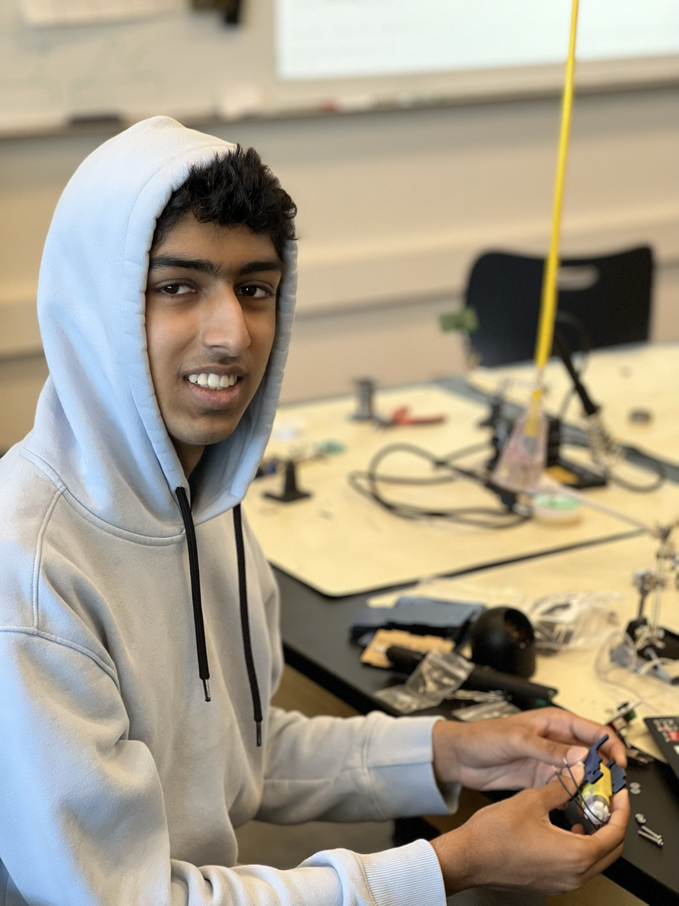

# 3 Joint Robotic Arm With Claw
The 3 Joint Robotic Arm is a fun device that is controlled using a controller and can move 360 degrees! The claw on the robot is even capable of carrying small objects. The arm is powered by 4 servos that help move the base, hinges, and claw. The claw is controlled seamlessly using 2 joystick modules screwed onto a base that is shaped like a video game controller!

| **Engineer** | **School** | **Area of Interest** | **Grade** |
|:--:|:--:|:--:|:--:|
| Tarun S | Irvington High School | Electrical Engineering/ Mechanical Engineering | Incoming Junior


  
# Third Milestone

<iframe width="560" height="315" src="https://www.youtube.com/embed/t2j5NnhMgvQ" title="YouTube video player" frameborder="0" allow="accelerometer; autoplay; clipboard-write; encrypted-media; gyroscope; picture-in-picture; web-share" allowfullscreen></iframe>

My third milestone was the combination of my second milestone and first milestone with the controller and the arm. The arm is powered by 5 double A batteries through the nano shield which holds the arduino nano. The combination of the controller and arm allows the controller to move the arm using the joystick modules. The potentiometer inside the joystick module inputs a certain voltage based on the direction that the joystick is pointing and the arduino converts this voltage into a numerical value. This numerical value is then inputted into my code which determines where the arm should be. Depending on the axis the arm moves in a different way. One challenge I had was actually getting the robot to reset after I turn it off and turn it back on meaning that it would start out at 90 degrees on all motors when I start the project, but by borrowing my code from my first milestone I was able to do it. I found out that the problem was as simple as adding a delay to the code. Now, I plan to make modifications like making the controller wireless with a bluetooth module and even printing a shell for the controller.

# Second Milestone

<iframe width="560" height="315" src="https://www.youtube.com/embed/scAhvEodq6w" title="YouTube video player" frameborder="0" allow="accelerometer; autoplay; clipboard-write; encrypted-media; gyroscope; picture-in-picture; web-share" allowfullscreen></iframe>

My second milestone was the assembly of my controller and getting output from it. The controller itself is literally just an acrylic piece, and there are 2 joystick modules screwed into it. The joystick modules have a potentiometer and depending on the direction you move the joystick the module produces an output from 0V to 5V or anywhere in between and the arduino converts the voltage into a numerical value on the serial monitor. With this milestone I had trouble importing libraries for my code to work, and I needed a library because libraries make things easier in the sense where I don't have to recode some code that someone has already written. I realized that in every library there is a needed source folder to narrow the arduinos search for files, so i added a source folder and everything worked. Next I plan to combine my first milestone which was fully assembling the robot and ensuring that all the components work, and my second milestone which was getting output from my controller to create a fully functioning arm, and after that I plan to make some modifications to the project by smoothening the movement of the robot.

# First Milestone

<iframe width="560" height="315" src="https://www.youtube.com/embed/uOCtF2aWj2o" title="YouTube video player" frameborder="0" allow="accelerometer; autoplay; clipboard-write; encrypted-media; gyroscope; picture-in-picture; web-share" allowfullscreen></iframe>

My first milestone was the assembly of my intensive project, the 3 Joint Robot Arm. I completed the assembly of the arm and for the arm I first started by building the base which holds down the battery, the arduino with its nano shield, and the motor which moves the base of the arm. There are 4 motors in total controlling the movement of the arm. The base motor controls the direction that the arm is in. 2 motors control 2 different hinges while there is another motor that controls the claw. The claw is only attached to one finger of the claw but the other is also in motion as a result of the gear that connects the two fingers. I also took time to cable manage the motor wires so that it would not hinder the movement of the robot. Finally I wrote some code to reset the robot to its original position whenever the arduino is on so when i change the direction of the motors and turn on the arduino, the arm will return to 90 degrees. I had trouble screwing down the base of the arm to the motor which hindered the motors ability to move the robot. The screw was too short, and I then found a longer screw to screw down the base to the motor. Next I plan to assemble, connect, and test the controller. I plan to write code to recieve and print the output of the joystick module. 

# Starter Project

<iframe width="560" height="315" src="https://www.youtube.com/embed/Q8K0SotvSBg" title="YouTube video player" frameborder="0" allow="accelerometer; autoplay; clipboard-write; encrypted-media; gyroscope; picture-in-picture; web-share" allowfullscreen></iframe>

My starter project is the Useless box, a prank box that provides hours of entertainment! The box itself is activated when the switch at the top is flipped, and then the acrylic arm attached the a motor is propelled up and the arm flips a hinge up and hits the switch again to turn it off. After the switch is hit by the arm, the arm retracts and hits a snap switch which stops the arm. The PCB has an LED, a snap switch, PCB terminal, and the switch at the top of the box soldered on. The build itself is powered by 3 triple-A batteries. While building the project i had an extremely hard time securing the case which I eventually solved by using a clamp to secure the corner posts so that i could put a screw through the post. This created an imprint of the screw which eventually made it easier to screw into the box. Next I plan to use my knowledge about motors to build the 3 Joint Robotic Arm.

# Schematics 

# Code

```c++
#include <CokoinoArm.h>
#define buzzerPin 9

CokoinoArm arm;
int xL,yL,xR,yR;

const int act_max=10;    //Default 10 action,4 the Angle of servo
int act[act_max][4];    //Only can change the number of action
int num=0,num_do=0;

void turnUD(void){
  if(xL!=512){
    if(0<=xL && xL<=100){arm.up(10);return;}
    if(900<xL && xL<=1024){arm.down(10);return;} 
    if(100<xL && xL<=200){arm.up(20);return;}
    if(800<xL && xL<=900){arm.down(20);return;}
    if(200<xL && xL<=300){arm.up(25);return;}
    if(700<xL && xL<=800){arm.down(25);return;}
    if(300<xL && xL<=400){arm.up(30);return;}
    if(600<xL && xL<=700){arm.down(30);return;}
    if(400<xL && xL<=480){arm.up(35);return;}
    if(540<xL && xL<=600){arm.down(35);return;} 
    }
}
void turnLR(void){
  if(yL!=512){
    if(0<=yL && yL<=100){arm.right(0);return;}
    if(900<yL && yL<=1024){arm.left(0);return;}  
    if(100<yL && yL<=200){arm.right(5);return;}
    if(800<yL && yL<=900){arm.left(5);return;}
    if(200<yL && yL<=300){arm.right(10);return;}
    if(700<yL && yL<=800){arm.left(10);return;}
    if(300<yL && yL<=400){arm.right(15);return;}
    if(600<yL && yL<=700){arm.left(15);return;}
    if(400<yL && yL<=480){arm.right(20);return;}
    if(540<yL && yL<=600){arm.left(20);return;}
  }
}
void turnCO(void){
  if(xR!=512){
    if(0<=xR && xR<=100){arm.close(0);return;}
    if(900<xR && xR<=1024){arm.open(0);return;} 
    if(100<xR && xR<=200){arm.close(5);return;}
    if(800<xR && xR<=900){arm.open(5);return;}
    if(200<xR && xR<=300){arm.close(10);return;}
    if(700<xR && xR<=800){arm.open(10);return;}
    if(300<xR && xR<=400){arm.close(15);return;}
    if(600<xR && xR<=700){arm.open(15);return;}
    if(400<xR && xR<=480){arm.close(20);return;}
    if(540<xR && xR<=600){arm.open(20);return;} 
    }
}
void date_processing(int *x,int *y){
  if(abs(512-*x)>abs(512-*y))
    {*y = 512;}
  else
    {*x = 512;}
}
void buzzer(int H,int L){
  while(yR<420){
    digitalWrite(buzzerPin,HIGH);
    delayMicroseconds(H);
    digitalWrite(buzzerPin,LOW);
    delayMicroseconds(L);
    yR = arm.JoyStickR.read_y();
    }
  while(yR>600){
    digitalWrite(buzzerPin,HIGH);
    delayMicroseconds(H);
    digitalWrite(buzzerPin,LOW);
    delayMicroseconds(L);
    yR = arm.JoyStickR.read_y();
    }
}
void C_action(void){
  if(yR>800){
    int *p;
    p=arm.captureAction();
    for(char i=0;i<4;i++){
    act[num][i]=*p;
    p=p+1;     
    }
    num++;
    num_do=num;
    if(num>=act_max){
      num=0;
      buzzer(600,400);
      }
    while(yR>600){yR = arm.JoyStickR.read_y();}
    
  }
}
void Do_action(void){
  if(yR<220){
    buzzer(200,300);
    for(int i=0;i<num_do;i++){
      arm.do_action(act[i],15);
      }
    num=0;
    while(yR<420){yR = arm.JoyStickR.read_y();}
    for(int i=0;i<2000;i++){
      digitalWrite(buzzerPin,HIGH);
      delayMicroseconds(200);
      digitalWrite(buzzerPin,LOW);
      delayMicroseconds(300);        
    }
  }
}
void setup() {
  Serial.begin(9600);
  //arm of servo motor connection pins
  arm.ServoAttach(4,5,6,7);
  //arm of joy stick connection pins : xL,yL,xR,yR
  arm.JoyStickAttach(A0,A1,A2,A3);
  pinMode(buzzerPin,OUTPUT);
}void loop() {
  xL = arm.JoyStickL.read_x();
  yL = arm.JoyStickL.read_y();
  xR = arm.JoyStickR.read_x();
  yR = arm.JoyStickR.read_y();
  date_processing(&xL,&yL);
  date_processing(&xR,&yR);
  turnUD();
  turnLR();
  turnCO();
  C_action();
  Do_action();
  Serial.print(arm.JoyStickL.read_x());
  Serial.print("\t");
  Serial.print(arm.JoyStickL.read_y());
  Serial.print("\t");
  Serial.print(arm.JoyStickR.read_x());
  Serial.print("\t");
  Serial.print(arm.JoyStickR.read_y());
  Serial.println(" ");
}
```

# Bill of Materials

| **Part** | **Note** | **Price** | **Link** |
|:--:|:--:|:--:|:--:|
| Cokoino arm robot kit | Contains complete arm and controller for Cokoino arm robot | $49.99 | https://www.amazon.com/LK-COKOINO-Compliment-Engineering-Technology/dp/B081FG1JQ1 |
|:--:|:--:|:--:|:--:|
| 2 HC-05 bluetooth modules | used for connecting controller and arm wirelessly | $15.99 | https://www.amazon.com/HiLetgo-Bluetooth-Transceiver-Integrated-Communication/dp/B07VL725T8/ref=sr_1_5?keywords=HC-05+bluetooth+module&qid=1689044968&sr=8-5 |
|:--:|:--:|:--:|:--:|
| 2 DC motors | Used to essentially turn the robotic arm into a rover | $8.90 | https://www.amazon.com/Stemedu-Gearbox-Motor-200RPM-Arduino/dp/B07L881GXZ/ref=sr_1_5?crid=251PBZYJ4EC2Q&keywords=2+dc+motors+with+wheel&qid=1689045181&sprefix=2+dc+motors+with+wheel%2Caps%2C139&sr=8-5 |
|:--:|:--:|:--:|:--:|
| 1 swivel wheel | To help turn the robot with the help of the 2 dc motors | $1.75 | https://www.amazon.com/Cofufu-Plastic-Rectangle-Swivel-Caster/dp/B00F5PNISQ/ref=sr_1_2?crid=KW68J9MR7CPP&keywords=swivel+wheel+robotics&qid=1689045972&sprefix=swivel+wheel+robotics%2Caps%2C157&sr=8-2 |
|:--:|:--:|:--:|:--:|
| 1 5xAA battery pack | Used to power the entirety of the arm (4 servos and bluetooth module) | $4.00 | https://www.amazon.com/LampVPath-Battery-Holder-Leads-Wires/dp/B07WRQ44YK/ref=sr_1_6?crid=3OUOUDN2BFP73&keywords=5+AA+battery+pack&qid=1689046519&sprefix=5+aa+battery+pack%2Caps%2C158&sr=8-6 |
|:--:|:--:|:--:|:--:|
| 1 4xAA battery pack | Used to power 2 joystick modules and a bluetooth module | $3.24 | https://www.amazon.com/LAMPVPATH-Battery-Holder-Leads-Wires/dp/B07T7MTRZX/ref=sr_1_3?crid=VMHQ24S2FOYN&keywords=4+AA+battery+holder&qid=1689046733&sprefix=4+aa+battery+holde%2Caps%2C141&sr=8-3 |
|:--:|:--:|:--:|:--:|
| Arduino nano | 2nd arduino nano used for the bluetooth module and joystick module to make controller wireless | $12.98 | https://www.amazon.com/Deegoo-ATmega328P-Microcontroller-Board-Arduino/dp/B07R9VWD39/ref=sr_1_9?crid=3T4FJ173WNZON&keywords=arduino+nano&qid=1689046855&sprefix=arduino+nano%2Caps%2C133&sr=8-9 |
|:--:|:--:|:--:|:--:|


